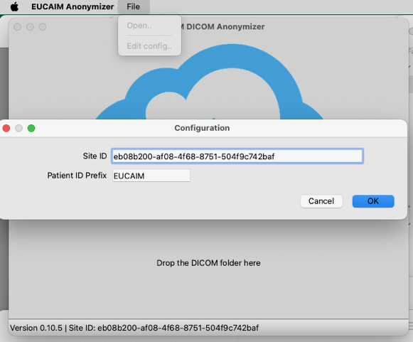

## EUCAIM DICOM Anonymization tool

A user friendly UI to perform DICOM Anonymization using the [EUCAIM](https://cancerimage.eu/) anonymization script. Please note that a more advanced command line interface (CLI) easily deployed with as a Docker container exists [here](https://github.com/sgsfak/eucaim_anon_pipeline/)

### Configuration

A `Site-ID` is a required configutation parameter that the Data Provider should request from the EUCAIM Technical Team. There is a `Config` menu item to set this parameter as shown in the following screenshot:

